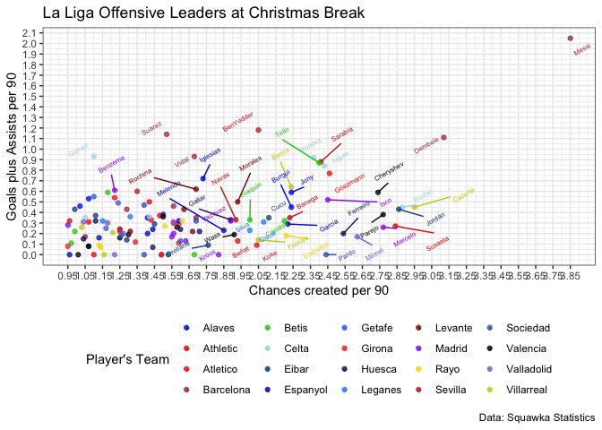
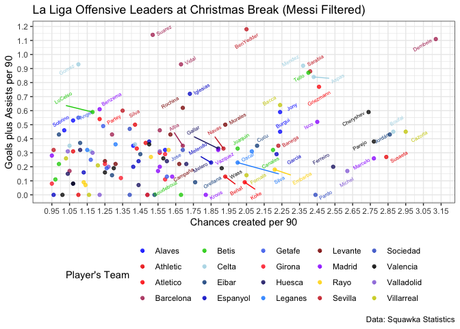

EDA
================
Eric Morris
12/28/2018

Data Import
-----------

All data was pulled manually from Squawka's Online Statistics Tool (scraping was difficult due to UI). Statistics were filtered for players with a minimum of 8 games played and were pulled on 12/28, during La Liga's Winter Break (all teams have played 17/38 matches except Real Madrid with 16). All statistics are per 90 minutes.

``` r
liga_stats = 
  read_excel("./data/Per90Stats.xlsx", col_names = TRUE) %>% 
  janitor::clean_names() %>% 
  spread(key = stat_category, value = p90) %>% 
  janitor::clean_names() %>% 
  mutate(goalsplusassists = (goals_scored + assists_created))
```

``` r
liga_stats %>% 
  ggplot(aes(x = chances_created, y = goalsplusassists, color = team)) +
  geom_point(alpha = 0.75) +
  geom_text_repel(aes(label = ifelse(goalsplusassists > 0.6, player, ifelse(chances_created > 1.75, player, ''))), angle = 30, size = 2) +
  scale_color_manual(values = c("Alaves" = "blue",
                               "Athletic" = "red2",
                               "Atletico" = "red",
                               "Barcelona" = "maroon",
                               "Betis" = "green3",
                               "Celta" = "lightblue",
                               "Eibar" = "dodgerblue4",
                               "Espanyol" = "mediumblue",
                               "Getafe" = "royalblue2",
                               "Girona" = "firebrick1",
                               "Huesca" = "midnightblue",
                               "Leganes" = "dodgerblue",
                               "Levante" = "red4",
                               "Madrid" = "purple1",
                               "Rayo" = "gold",
                               "Sevilla" = "firebrick3",
                               "Sociedad" = "royalblue3",
                               "Valencia"  = "gray0",
                               "Valladolid" = "mediumpurple",
                               "Villarreal" = "yellow3")) + 
  labs(title = "La Liga Offensive Leaders at Christmas Break", 
       y = "Goals plus Assists per 90", 
       x = "Chances created per 90", 
       color = "Player's Team",
       caption = "Data: Squawka Statistics") + 
  scale_x_continuous(breaks = seq(0.95, 3.90, 0.10)) + 
  scale_y_continuous(breaks = seq(0, 2.10, 0.10)) + 
  theme_bw() +
  theme(legend.position = "bottom") 
```



``` r
# Chart without Messi

liga_stats %>% 
  filter(player != "Messi") %>% 
  ggplot(aes(x = chances_created, y = goalsplusassists, color = team)) +
  geom_point(alpha = 0.75) +
  geom_text_repel(aes(label = ifelse(goalsplusassists > 0.5, player, ifelse(chances_created > 1.65, player, ''))), angle = 30, size = 2) +
  scale_color_manual(values = c("Alaves" = "blue",
                               "Athletic" = "red2",
                               "Atletico" = "red",
                               "Barcelona" = "maroon",
                               "Betis" = "green3",
                               "Celta" = "lightblue",
                               "Eibar" = "dodgerblue4",
                               "Espanyol" = "mediumblue",
                               "Getafe" = "royalblue2",
                               "Girona" = "firebrick1",
                               "Huesca" = "midnightblue",
                               "Leganes" = "dodgerblue",
                               "Levante" = "red4",
                               "Madrid" = "purple1",
                               "Rayo" = "gold",
                               "Sevilla" = "firebrick3",
                               "Sociedad" = "royalblue3",
                               "Valencia"  = "gray0",
                               "Valladolid" = "mediumpurple",
                               "Villarreal" = "yellow3")) + 
  labs(title = "La Liga Offensive Leaders at Christmas Break (Messi Filtered)", 
       y = "Goals plus Assists per 90", 
       x = "Chances created per 90", 
       color = "Player's Team",
       caption = "Data: Squawka Statistics") + 
  scale_x_continuous(breaks = seq(0.95, 3.90, 0.10)) + 
  scale_y_continuous(breaks = seq(0, 2.10, 0.10)) + 
  theme_bw() +
  theme(legend.position = "bottom") 
```


