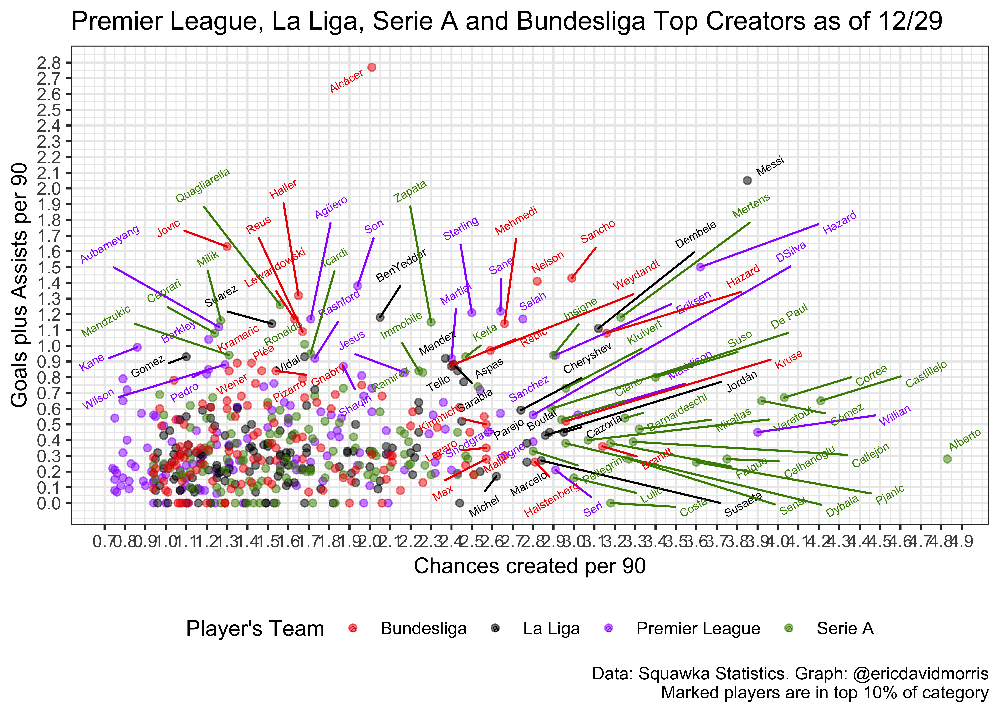

EDA
================
Eric Morris
12/28/2018

La Liga Data Import
-------------------

All data was pulled manually from Squawka's Online Statistics Tool (scraping was difficult due to UI). Statistics were filtered for players with a minimum of 8 games played and were pulled on 12/28, during La Liga's Winter Break (all teams have played 17/38 matches except Real Madrid with 16). All statistics are per 90 minutes.

``` r
liga_stats = 
  read_excel("./data/LigaPer90Stats.xlsx", col_names = TRUE) %>% 
  janitor::clean_names() %>% 
  spread(key = stat_category, value = p90) %>% 
  janitor::clean_names() %>% 
  mutate(goalsplusassists = (goals_scored + assists_created))
```

``` r
liga_stats %>% 
  ggplot(aes(x = chances_created, y = goalsplusassists, color = team)) +
  geom_point(alpha = 0.75) +
  geom_text_repel(aes(label = ifelse(goalsplusassists > 0.6, player, ifelse(chances_created > 1.65, player, ''))), angle = 30, size = 2) +
  scale_color_manual(values = c("Alaves" = "blue",
                               "Athletic" = "red2",
                               "Atletico" = "red",
                               "Barcelona" = "maroon",
                               "Betis" = "green3",
                               "Celta" = "lightblue",
                               "Eibar" = "dodgerblue4",
                               "Espanyol" = "mediumblue",
                               "Getafe" = "royalblue2",
                               "Girona" = "firebrick1",
                               "Huesca" = "midnightblue",
                               "Leganes" = "dodgerblue",
                               "Levante" = "red4",
                               "Madrid" = "purple1",
                               "Rayo" = "gold",
                               "Sevilla" = "firebrick3",
                               "Sociedad" = "royalblue3",
                               "Valencia"  = "gray0",
                               "Valladolid" = "mediumpurple",
                               "Villarreal" = "yellow3")) + 
  labs(title = "La Liga Creative Leaders at Christmas Break", 
       y = "Goals plus Assists per 90", 
       x = "Chances created per 90", 
       color = "Player's Team",
       caption = "Data: Squawka Statistics") + 
  scale_x_continuous(breaks = seq(0.95, 3.90, 0.10)) + 
  scale_y_continuous(breaks = seq(0, 2.10, 0.10)) + 
  theme_bw() +
  theme(legend.position = "bottom") 
```


``` r
# Chart without Messi

liga_stats %>% 
  filter(player != "Messi") %>% 
  ggplot(aes(x = chances_created, y = goalsplusassists, color = team)) +
  geom_point(alpha = 0.75) +
  geom_text_repel(aes(label = ifelse(goalsplusassists > 0.5, player, ifelse(chances_created > 1.65, player, ''))), angle = 30, size = 2) +
  scale_color_manual(values = c("Alaves" = "blue",
                               "Athletic" = "red2",
                               "Atletico" = "red",
                               "Barcelona" = "maroon",
                               "Betis" = "green3",
                               "Celta" = "lightblue",
                               "Eibar" = "dodgerblue4",
                               "Espanyol" = "mediumblue",
                               "Getafe" = "royalblue2",
                               "Girona" = "firebrick1",
                               "Huesca" = "midnightblue",
                               "Leganes" = "dodgerblue",
                               "Levante" = "red4",
                               "Madrid" = "purple1",
                               "Rayo" = "gold",
                               "Sevilla" = "firebrick3",
                               "Sociedad" = "royalblue3",
                               "Valencia"  = "gray0",
                               "Valladolid" = "mediumpurple",
                               "Villarreal" = "yellow3")) + 
  labs(title = "La Liga Creative Leaders at Christmas Break (Messi Filtered)", 
       y = "Goals plus Assists per 90", 
       x = "Chances created per 90", 
       color = "Player's Team",
       caption = "Data: Squawka Statistics") + 
  scale_x_continuous(breaks = seq(0.95, 3.90, 0.10)) + 
  scale_y_continuous(breaks = seq(0, 2.10, 0.10)) + 
  theme_bw() +
  theme(legend.position = "bottom") 
```


EPL Data Import
---------------

All data was pulled manually from Squawka's Online Statistics Tool (scraping was difficult due to UI). Statistics were filtered for players with a minimum of 10 games played and were pulled on 12/29, after the Boxing Day matches (all teams have played 19 matches). All statistics are per 90 minutes. Filtered for &gt; 0.74 chances created per 90.

``` r
epl_stats = 
  read_excel("./data/EPLPer90Stats.xlsx", col_names = TRUE) %>% 
  janitor::clean_names() %>% 
  spread(key = stat_category, value = p90) %>% 
  janitor::clean_names() %>% 
  mutate(goalsplusassists = (goals_scored + assists_created))

epl_stats %>% 
  group_by(team) %>% 
  summarize()
```

    ## # A tibble: 20 x 1
    ##    team             
    ##    <chr>            
    ##  1 Arsenal          
    ##  2 Bournemouth      
    ##  3 Brighton         
    ##  4 Burnley          
    ##  5 Cardiff          
    ##  6 Chelsea          
    ##  7 Crystal Palace   
    ##  8 Everton          
    ##  9 Fulham           
    ## 10 Huddersfield     
    ## 11 Leicester        
    ## 12 Liverpool        
    ## 13 Manchester City  
    ## 14 Manchester United
    ## 15 Newcastle        
    ## 16 Southampton      
    ## 17 Tottenham        
    ## 18 Watford          
    ## 19 West Ham         
    ## 20 Wolverhampton

``` r
epl_stats %>% 
  ggplot(aes(x = chances_created, y = goalsplusassists, color = team)) +
  geom_point(alpha = 0.75) +
  geom_text_repel(aes(label = ifelse(goalsplusassists > 0.6, player, ifelse(chances_created > 1.50, player, ''))), angle = 30, size = 2) +
  scale_color_manual(values = c("Arsenal" = "firebrick1",
                                "Bournemouth" = "gray0",
                                "Brighton" = "dodgerblue",
                                "Burnley" = "maroon",
                                "Cardiff" = "brown1",     
                                "Chelsea" = "blue",
                                "Crystal Palace" = "purple1",
                                "Everton" = "mediumblue",
                                "Fulham" = "gray48",        
                                "Huddersfield" = "yellow3",   
                                "Leicester" = "cornflowerblue",       
                                "Liverpool" = "red2",       
                                "Manchester City" = "cadetblue2",  
                                "Manchester United" = "firebrick3",
                                "Newcastle" = "gray12",       
                                "Southampton" = "tomato3",    
                                "Tottenham" = "snow3",       
                                "Watford" = "yellow3",       
                                "West Ham" = "violetred4",      
                                "Wolverhampton" = "orange1")) + 
  labs(title = "Premier League and La Liga as of 12/29", 
       y = "Goals plus Assists per 90", 
       x = "Chances created per 90", 
       color = "Player's Team",
       caption = "Data: Squawka Statistics. Graph: @ericdavidmorris") + 
  scale_x_continuous(breaks = seq(0.70, 4.00, 0.10)) + 
  scale_y_continuous(breaks = seq(0, 1.7, 0.10)) + 
  theme_bw() +
  theme(legend.position = "bottom") 
```


EPL and La Liga merged stats
----------------------------

``` r
merged = 
  bind_rows(epl_stats, liga_stats)

merged %>% 
  ggplot(aes(x = chances_created, y = goalsplusassists, color = league)) +
  geom_point(alpha = 0.75) +
  geom_text_repel(aes(label = ifelse(goalsplusassists > 0.6, player, ifelse(chances_created > 1.7, player, ''))), angle = 30, size = 2) +
  labs(title = "Premier League and La Liga Creators as of 12/29", 
       y = "Goals plus Assists per 90", 
       x = "Chances created per 90", 
       color = "Player's Team",
       caption = "Data: Squawka Statistics. Graph: @ericdavidmorris") + 
  scale_x_continuous(breaks = seq(0.70, 4.00, 0.10)) + 
  scale_y_continuous(breaks = seq(0, 2.10, 0.10)) + 
  theme_bw() +
  theme(legend.position = "bottom") 
```


Bundesliga
----------

All data was pulled manually from Squawka's Online Statistics Tool (scraping was difficult due to UI). Statistics were filtered for players with a minimum of 10 games played and were pulled on 12/29. All statistics are per 90 minutes. Filtered for &gt; 0.94 chances created per 90.

``` r
bund_stats = 
  read_excel("./data/BundesligaPer90Stats.xlsx", col_names = TRUE) %>% 
  janitor::clean_names() %>% 
  spread(key = stat_category, value = p90) %>% 
  janitor::clean_names() %>% 
  mutate(goalsplusassists = (goals_scored + assists_created))

bund_stats %>% 
  group_by(team) %>% 
  summarize()
```

    ## # A tibble: 18 x 1
    ##    team           
    ##    <chr>          
    ##  1 Augsburg       
    ##  2 Bayern Munich  
    ##  3 Dortmund       
    ##  4 Düsseldorf     
    ##  5 Frankfurt      
    ##  6 Freiburg       
    ##  7 Hannover       
    ##  8 Hertha         
    ##  9 Hoffenheim     
    ## 10 Leipzig        
    ## 11 Leverkusen     
    ## 12 Mainz          
    ## 13 Mönchengladbach
    ## 14 Nürnberg       
    ## 15 Schalke        
    ## 16 Stuttgart      
    ## 17 Werder Bremen  
    ## 18 Wolfsburg

``` r
bund_stats %>% 
  ggplot(aes(x = chances_created, y = goalsplusassists, color = team)) +
  geom_point(alpha = 0.75) +
  geom_text_repel(aes(label = ifelse(goalsplusassists > 0.6, player, ifelse(chances_created > 1.6, player, ''))), angle = 30, size = 2) +
  scale_color_manual(values = c("Augsburg" = "dimgray",
                                "Bayern Munich" = "firebrick2",
                                "Dortmund" = "gold1",
                                "Düsseldorf" = "tomato3",  
                                "Frankfurt" = "gray0",
                                "Freiburg" = "gray25",       
                                "Hannover" = "chartreuse4",       
                                "Hertha" = "dodgerblue2",       
                                "Hoffenheim" = "blue1",     
                                "Leipzig" = "navy",    
                                "Leverkusen" = "firebrick4", 
                                "Mainz" = "red1",       
                                "Mönchengladbach" = "green3",
                                "Nürnberg" = "tomato4",     
                                "Schalke" = "blue3",        
                                "Stuttgart" = "orangered2",    
                                "Werder Bremen" = "springgreen3", 
                                "Wolfsburg" = "limegreen")) + 
  labs(title = "Bundesliga Creative Leaders at Christmas Break", 
       y = "Goals plus Assists per 90", 
       x = "Chances created per 90", 
       color = "Player's Team",
       caption = "Data: Squawka Statistics. Graph: @ericdavidmorris") + 
  scale_x_continuous(breaks = seq(0.9, 3.2, 0.10)) + 
  scale_y_continuous(breaks = seq(0, 2.8, 0.10)) + 
  theme_bw() +
  theme(legend.position = "bottom") 
```


Serie A
-------

All data was pulled manually from Squawka's Online Statistics Tool (scraping was difficult due to UI). Statistics were filtered for players with a minimum of 10 games played and were pulled on 12/29. All statistics are per 90 minutes. Filtered for &gt; 0.94 chances created per 90.

``` r
serie_stats = 
  read_excel("./data/SerieAPer90Stats.xlsx", col_names = TRUE) %>% 
  janitor::clean_names() %>% 
  spread(key = stat_category, value = p90) %>% 
  janitor::clean_names() %>% 
  mutate(goalsplusassists = (goals_scored + assists_created))

serie_stats %>% 
  group_by(team) %>% 
  summarize()
```

    ## # A tibble: 20 x 1
    ##    team          
    ##    <chr>         
    ##  1 Atalanta      
    ##  2 Bologna       
    ##  3 Cagliari      
    ##  4 Chievo        
    ##  5 Empoli        
    ##  6 Fiorentina    
    ##  7 Frosinone     
    ##  8 Genoa         
    ##  9 Internazionale
    ## 10 Juventus      
    ## 11 Lazio         
    ## 12 Milan         
    ## 13 Napoli        
    ## 14 Parma         
    ## 15 Roma          
    ## 16 Sampdoria     
    ## 17 Sassuolo      
    ## 18 SPAL          
    ## 19 Torino        
    ## 20 Udinese

``` r
serie_stats %>% 
  ggplot(aes(x = chances_created, y = goalsplusassists, color = team)) +
  geom_point(alpha = 0.75) +
  geom_text_repel(aes(label = ifelse(goalsplusassists > 0.6, player, ifelse(chances_created > 1.7, player, ''))), angle = 30, size = 2) +
  scale_color_manual(values = c("Atalanta" = "mediumblue",
                                "Bologna" = "navy",    
                                "Cagliari" = "midnightblue",    
                                "Chievo" = "gold1",        
                                "Empoli" = "coral1",        
                                "Fiorentina" = "purple4",    
                                "Frosinone" = "yellow3",     
                                "Genoa" = "royalblue4",       
                                "Internazionale" = "royalblue",
                                "Juventus" = "black",      
                                "Lazio" = "lightblue",         
                                "Milan" = "firebrick2",        
                                "Napoli" = "dodgerblue",
                                "Parma" = "gray",         
                                "Roma" = "darkorange",        
                                "Sampdoria" = "royalblue2", 
                                "Sassuolo" = "seagreen",
                                "SPAL" = "steelblue3",   
                                "Torino" = "tomato4",
                                "Udinese" = "gray47")) + 
  labs(title = "Serie A Creative Leaders on 12/29", 
       y = "Goals plus Assists per 90", 
       x = "Chances created per 90", 
       color = "Player's Team",
       caption = "Data: Squawka Statistics. Graph: @ericdavidmorris") + 
  scale_x_continuous(breaks = seq(0.9, 4.9, 0.10)) + 
  scale_y_continuous(breaks = seq(0, 1.3, 0.10)) + 
  theme_bw() +
  theme(legend.position = "bottom") 
```


Top 4 Leagues Merged
--------------------

``` r
top4_merged = 
  bind_rows(epl_stats, liga_stats, serie_stats, bund_stats)

top4_merged %>% 
  ggplot(aes(x = chances_created, y = goalsplusassists, color = league)) +
  geom_point(alpha = 0.5) +
  geom_text_repel(aes(label = ifelse(goalsplusassists >= 0.83, player, ifelse(chances_created >= 2.57, player, ''))), angle = 30, size = 2) +
  labs(title = "Premier League, La Liga, Serie A and Bundesliga Top Creators as of 12/29", 
       y = "Goals plus Assists per 90", 
       x = "Chances created per 90", 
       color = "Player's Team",
       caption = "Data: Squawka Statistics. Graph: @ericdavidmorris
       Marked players are in top 10% of category") + 
  scale_x_continuous(breaks = seq(0.70, 4.9, 0.10)) + 
  scale_y_continuous(breaks = seq(0, 2.8, 0.10)) + 
  theme_bw() +
  scale_color_manual(values = c("Bundesliga" = "red2",
                                "La Liga" = "black",
                                "Premier League" = "purple1",
                                "Serie A" = "chartreuse4")) + 
  theme(legend.position = "bottom") 
```


