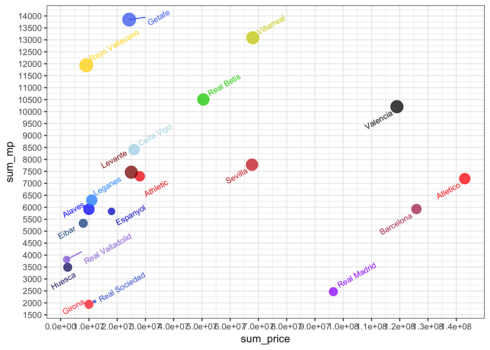
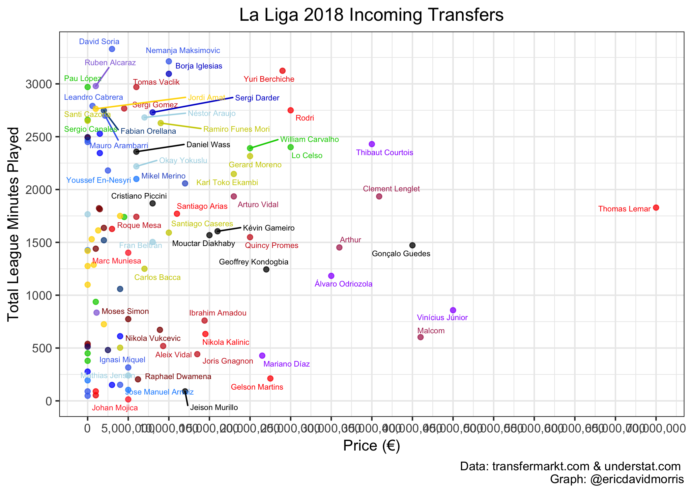
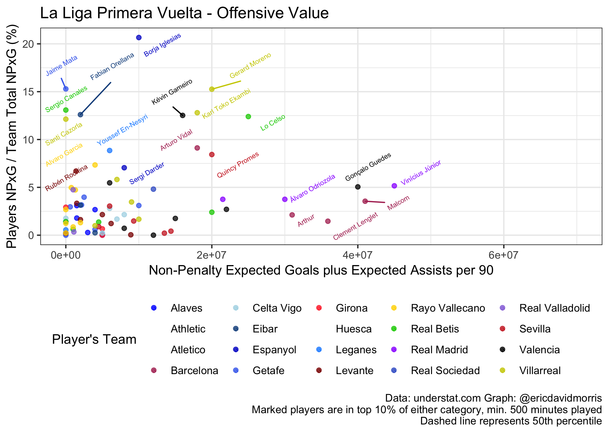
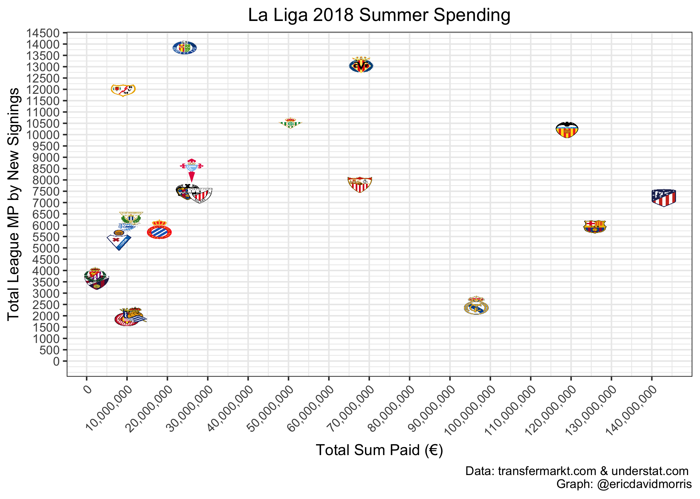
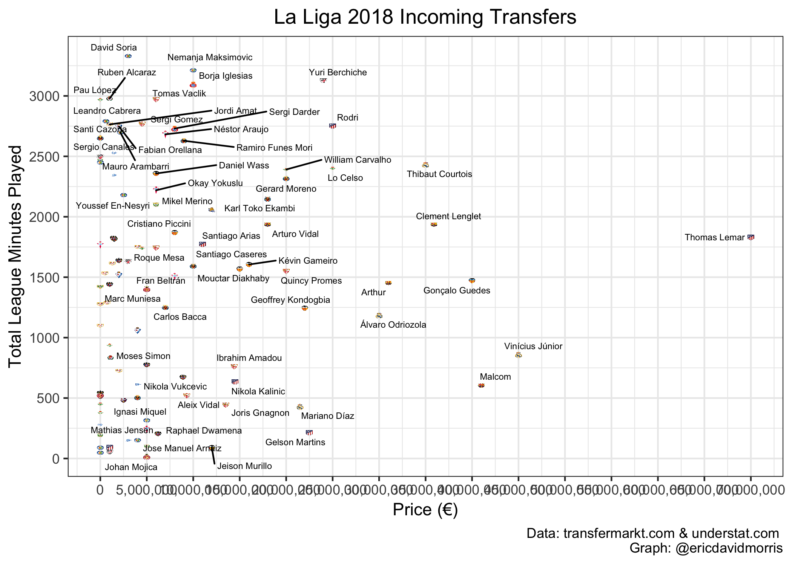

La Liga Fichajes
================
Eric Morris
7/11/2019

La Liga Fichajes Data Import
----------------------------

``` r
fichajes = 
  read_excel("./data/1819_laliga_fichajes.xlsx", col_names = TRUE) %>% 
  janitor::clean_names() %>% 
  mutate(xg = as.numeric(x_g),
         xa = as.numeric(x_a),
         xg90 = as.numeric(x_g90),
         xa90 = as.numeric(x_a90)) %>% 
  mutate(xg90_plus_xa90 = xg90 + xa90,
         xg_plus_xa = xg + xa) %>% 
   select(-x_g, -x_a, -x_g90, -x_a90) 
```

    ## Warning in evalq(as.numeric(x_g), <environment>): NAs introduced by
    ## coercion

    ## Warning in evalq(as.numeric(x_a), <environment>): NAs introduced by
    ## coercion

    ## Warning in evalq(as.numeric(x_g90), <environment>): NAs introduced by
    ## coercion

    ## Warning in evalq(as.numeric(x_a90), <environment>): NAs introduced by
    ## coercion

``` r
club_badges_fichajes = 
  read_excel("./data/1819_laliga_logos.xlsx", col_names = TRUE) %>% 
  left_join(fichajes, by = c("club" = "club"))

fichajes_nogk =
  fichajes %>% 
  filter(g != "-")

club_badges_fichajes_nogk =
  club_badges_fichajes %>% 
  filter(g != "-")

team_fichajes = 
  fichajes_nogk %>% 
  group_by(club) %>% 
  summarize(sum_price = sum(price),
            sum_xg = sum(xg),
            sum_xa = sum(xa),
            sum_mp = sum(mp),
            n = n(),
            avg = sum(price)/n,
            ppxg = avg/sum(xg),
            ppmp = avg/sum(mp))

team_fichajes_badges =
  read_excel("./data/1819_laliga_logos.xlsx", col_names = TRUE) %>% 
  left_join(team_fichajes, by = c("club" = "club"))
```

By team frugality and quantiles
-------------------------------

``` r
fichajes_nogk %>% 
  group_by(club) %>% 
  summarize(sum(price),
            sum(xg),
            sum(xa),
            sum(mp),
            n = n(),
            avg = sum(price)/n,
            ppxg = avg/sum(xg),
            ppmp = avg/sum(mp))
```

    ## # A tibble: 20 x 9
    ##    club  `sum(price)` `sum(xg)` `sum(xa)` `sum(mp)`     n    avg   ppxg
    ##    <chr>        <dbl>     <dbl>     <dbl>     <dbl> <int>  <dbl>  <dbl>
    ##  1 Alav…     10000000      4.43      3.59      5913     5 2.00e6 4.51e5
    ##  2 Athl…     28000000      1.78      3.05      7294     4 7.00e6 3.93e6
    ##  3 Atle…    143000000      8.86      6.21      7195     5 2.86e7 3.23e6
    ##  4 Barc…    125900000      7.39      8.86      5925     4 3.15e7 4.26e6
    ##  5 Celt…     26000000      5.21      3.41      8411     5 5.20e6 9.98e5
    ##  6 Eibar      8000000      8.24      7.75      5327     3 2.67e6 3.24e5
    ##  7 Espa…     18000000     19.1       8.58      5825     2 9.00e6 4.70e5
    ##  8 Geta…     24250000     19.9       9.2      13849     8 3.03e6 1.52e5
    ##  9 Giro…     10000000      3.24      0.34      1941     3 3.33e6 1.03e6
    ## 10 Hues…      2500000      1.22      2.5       3489     3 8.33e5 6.83e5
    ## 11 Lega…     11000000      8.03      3.14      6294     5 2.20e6 2.74e5
    ## 12 Leva…     25000000      7.85      7.4       7464     7 3.57e6 4.55e5
    ## 13 Rayo…      9050000     13.8       9.59     11935     8 1.13e6 8.22e4
    ## 14 Real…     50500000     19.1      12.2      10508     6 8.42e6 4.41e5
    ## 15 Real…     96500000      7.04      5.62      2469     3 3.22e7 4.57e6
    ## 16 Real…     12000000      2.78      2.03      2058     1 1.20e7 4.32e6
    ## 17 Real…      2100000      4.09      1         3814     2 1.05e6 2.57e5
    ## 18 Sevi…     67700000      6.61      7.86      7779     6 1.13e7 1.71e6
    ## 19 Vale…    119000000     16.1      12.1      10206     7 1.70e7 1.06e6
    ## 20 Vill…     68000000     34.6      17.6      13088     7 9.71e6 2.81e5
    ## # ... with 1 more variable: ppmp <dbl>

``` r
#Tiers for player labels

quantile(fichajes_nogk$xg_plus_xa, c(0.5, 0.75, 0.80, 0.85, 0.90, 0.95))
```

    ##     50%     75%     80%     85%     90%     95% 
    ##  2.1350  4.6200  5.0940  6.7175  9.0390 12.6700

``` r
quantile(fichajes_nogk$price, c(0.5, 0.75, 0.80, 0.85, 0.90, 0.95))
```

    ##      50%      75%      80%      85%      90%      95% 
    ##  5000000 12000000 15400000 20000000 23550000 32715000

``` r
quantile(fichajes_nogk$mp, c(0.5, 0.75, 0.80, 0.85, 0.90, 0.95))
```

    ##     50%     75%     80%     85%     90%     95% 
    ## 1558.50 2337.75 2458.00 2630.10 2720.70 2775.40

``` r
quantile(fichajes$price, c(0.5, 0.75, 0.80, 0.85, 0.90, 0.95))
```

    ##      50%      75%      80%      85%      90%      95% 
    ##  4500000 11500000 14800000 20000000 23700000 34600000

``` r
quantile(fichajes$mp, c(0.5, 0.75, 0.80, 0.85, 0.90, 0.95))
```

    ##    50%    75%    80%    85%    90%    95% 
    ## 1549.0 2374.5 2482.0 2657.3 2749.6 2970.0

``` r
quantile(team_fichajes$sum_price, c(0.5, 0.75, 0.80, 0.85, 0.90, 0.95))
```

    ##       50%       75%       80%       85%       90%       95% 
    ##  24625000  67775000  73700000  99875000 119690000 126755000

``` r
quantile(team_fichajes$sum_mp, c(0.5, 0.75, 0.80, 0.85, 0.90, 0.95))
```

    ##      50%      75%      80%      85%      90%      95% 
    ##  6744.50  8859.75 10266.40 10722.05 12050.30 13126.05

Charts
------

``` r
# Team chart (total minutes x total cost)

team_fichajes %>% 
  ggplot(aes(x = sum_price, y = sum_mp, color = club, size = n)) +
  geom_point(alpha = 0.75) + 
  geom_text_repel(aes(label = club, angle = 30, size = 2)) + 
  scale_color_manual(values = c("Athletic" = "red2",
                                "Alaves" = "blue",
                                "Atletico" = "red",
                                "Barcelona" = "maroon",
                                "Celta Vigo" = "lightblue",
                                "Eibar" = "dodgerblue4",
                                "Espanyol" = "mediumblue",
                                "Getafe" = "royalblue2",
                                "Girona" = "firebrick1",
                                "Leganes" = "dodgerblue",
                                "Levante" = "red4",
                                "Rayo Vallecano" = "gold",
                                "Real Betis" = "green3",
                                "Real Madrid" = "purple1",
                                "Real Sociedad" = "royalblue3",
                                "Real Valladolid" = "mediumpurple",
                                "Huesca" = "midnightblue",
                                "Sevilla" = "firebrick3",
                                "Valencia"  = "gray0",
                                "Villarreal" = "yellow3")) + 
  scale_x_continuous(breaks = seq(0, 145000000, 10000000)) + 
  scale_y_continuous(breaks = seq(1000, 14000, 500)) + 
  theme_bw() +
  theme(legend.position = "none")
```



``` r
# Player Chart (total min x total cost)

fichajes %>% 
  ggplot(aes(x = price, y = mp, color = club)) +
  geom_point(alpha = 0.75) + 
  geom_text_repel(aes(label = ifelse(mp >= 2600, name, ifelse(price >= 5000000, name, ''))), angle = 0, size = 2) +
  scale_color_manual(values = c("Athletic" = "red2",
                                "Alaves" = "blue",
                                "Atletico" = "red",
                                "Barcelona" = "maroon",
                                "Celta Vigo" = "lightblue",
                                "Eibar" = "dodgerblue4",
                                "Espanyol" = "mediumblue",
                                "Getafe" = "royalblue2",
                                "Girona" = "firebrick1",
                                "Leganes" = "dodgerblue",
                                "Levante" = "red4",
                                "Rayo Vallecano" = "gold",
                                "Real Betis" = "green3",
                                "Real Madrid" = "purple1",
                                "Real Sociedad" = "royalblue3",
                                "Real Valladolid" = "mediumpurple",
                                "Huesca" = "midnightblue",
                                "Sevilla" = "firebrick3",
                                "Valencia"  = "gray0",
                                "Villarreal" = "yellow3")) + 
    labs(title = "La Liga 2018 Incoming Transfers", 
       y = "Total League Minutes Played", 
       x = "Price (€)", 
       color = "Player's Team",
       caption = "Data: transfermarkt.com & understat.com 
       Graph: @ericdavidmorris") +
  scale_x_continuous(labels = comma, breaks = seq(0, 75000000, 5000000)) + 
  scale_y_continuous(breaks = seq(0, 4000, 500)) + 
  theme_bw() +
  theme(legend.position = "none") +
  theme(plot.title = element_text(hjust = 0.5))
```



``` r
fichajes_nogk %>% 
  ggplot(aes(x = price, y = xg_plus_xa, color = club)) +
  geom_point(alpha = 0.75) +
  geom_text_repel(aes(label = ifelse(xg_plus_xa >= 6.7, name, ifelse(price >= 23000000, name, ''))), angle = 30, size = 2) +
  scale_color_manual(values = c("Athletic Club" = "red2",
                                "Alaves" = "blue",
                                "Atletico Madrid" = "red",
                                "Barcelona" = "maroon",
                                "Celta Vigo" = "lightblue",
                                "Eibar" = "dodgerblue4",
                                "Espanyol" = "mediumblue",
                                "Getafe" = "royalblue2",
                                "Girona" = "firebrick1",
                                "Leganes" = "dodgerblue",
                                "Levante" = "red4",
                                "Rayo Vallecano" = "gold",
                                "Real Betis" = "green3",
                                "Real Madrid" = "purple1",
                                "Real Sociedad" = "royalblue3",
                                "Real Valladolid" = "mediumpurple",
                                "SD Huesca" = "midnightblue",
                                "Sevilla" = "firebrick3",
                                "Valencia"  = "gray0",
                                "Villarreal" = "yellow3")) + 
  labs(title = "La Liga Primera Vuelta - Offensive Value", 
       y = "Players NPxG / Team Total NPxG (%)", 
       x = "Non-Penalty Expected Goals plus Expected Assists per 90", 
       color = "Player's Team",
       caption = "Data: understat.com Graph: @ericdavidmorris
       Marked players are in top 10% of either category, min. 500 minutes played
       Dashed line represents 50th percentile") + 
  #scale_x_continuous(breaks = seq(0, 1.25, 0.05)) + 
  #scale_y_continuous(breaks = seq(0, 34, 1)) + 
  #geom_hline(yintercept = 3.95, linetype = "dashed", color = "black") + 
  #geom_vline(xintercept = 0.17, linetype = "dashed", color = "black") +
  theme_bw() +
  theme(legend.position = "bottom")
```

    ## Warning: Removed 12 rows containing missing values (geom_point).



``` r
##Charts with images

team_fichajes_badges %>% 
  ggplot(aes(x = sum_price, y = sum_mp)) +
  geom_image(aes(image = url), size = 0.04) +
  labs(title = "La Liga 2018 Summer Spending",
       y = "Total League MP by New Signings",
       x = "Total Sum Paid (€)",
       caption = "Data: transfermarkt.com & understat.com 
       Graph: @ericdavidmorris") +
  scale_x_continuous(labels = comma, breaks = seq(0, 145000000, 10000000)) + 
  scale_y_continuous(breaks = seq(0, 15500, 500)) + 
  theme_bw() +
  #geom_hline(yintercept = 6744, linetype = "dashed", color = "black") + 
  #geom_vline(xintercept = 24000000, linetype = "dashed", color = "black") +
  theme(plot.title = element_text(hjust = 0.5),
        axis.text.x = element_text(angle = 45, hjust = 1)) + 
  expand_limits(y = 0)
```



``` r
club_badges_fichajes %>% 
  ggplot(aes(x = price, y = mp)) +
  geom_image(aes(image = url), size = 0.01) + 
  geom_text_repel(aes(label = ifelse(mp >= 2600, name, ifelse(price >= 5000000, name, ''))), angle = 0, size = 2) +
  labs(title = "La Liga 2018 Incoming Transfers", 
       y = "Total League Minutes Played", 
       x = "Price (€)",
       caption = "Data: transfermarkt.com & understat.com 
       Graph: @ericdavidmorris") +
  scale_x_continuous(labels = comma, breaks = seq(0, 75000000, 5000000)) + 
  scale_y_continuous(breaks = seq(0, 4000, 500)) + 
  theme_bw() +
  theme(legend.position = "none") +
  theme(plot.title = element_text(hjust = 0.5))
```


