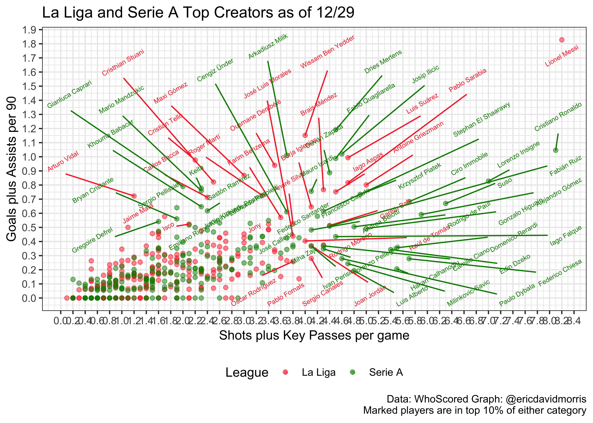

WhoScored Data
================
Eric Morris
12/30/2018

La Liga
-------

All data was pulled manually from WhoScored (scraping was difficult due to UI). Statistics were filtered for players with a WhoScored's automatic minimum appearances filter (players with total appearances greater than the average number of appearances in Primera Division) and then further filtered to only include players with &gt;500 minutes played. Statistics were pulled on 12/29, during La Liga's Winter Break (all teams have played 17/38 matches except Real Madrid with 16).

``` r
ws_liga_stats = 
  read_excel("./data/WhoScoredLaLigaStats.xlsx", col_names = TRUE) %>% 
  janitor::clean_names() %>% 
  separate(player, into = c("name", "team"), sep = ",") %>%
  mutate(goals_per_90 = (goals / mins) * 90,
         assists_per_90 = (assists / mins) * 90,
         gpa_per_90 = goals_per_90 + assists_per_90,
         shots_kp_game = shots_per_game + key_passes_per_g)
```

    ## Warning: Expected 2 pieces. Additional pieces discarded in 236 rows [1, 2,
    ## 3, 4, 5, 6, 7, 8, 9, 10, 11, 12, 13, 14, 15, 16, 17, 18, 19, 20, ...].

``` r
ws_liga_stats %>% 
  group_by(team) %>% 
  summarize()
```

    ## # A tibble: 20 x 1
    ##    team               
    ##    <chr>              
    ##  1 " Athletic Bilbao" 
    ##  2 " Atletico Madrid" 
    ##  3 " Barcelona"       
    ##  4 " Celta Vigo"      
    ##  5 " Deportivo Alaves"
    ##  6 " Eibar"           
    ##  7 " Espanyol"        
    ##  8 " Getafe"          
    ##  9 " Girona"          
    ## 10 " Leganes"         
    ## 11 " Levante"         
    ## 12 " Rayo Vallecano"  
    ## 13 " Real Betis"      
    ## 14 " Real Madrid"     
    ## 15 " Real Sociedad"   
    ## 16 " Real Valladolid" 
    ## 17 " SD Huesca"       
    ## 18 " Sevilla"         
    ## 19 " Valencia"        
    ## 20 " Villarreal"

``` r
quantile(ws_liga_stats$shots_kp_game, c(0.5, 0.75, 0.80, 0.85, 0.90))
```

    ##  50%  75%  80%  85%  90% 
    ## 1.60 2.60 2.70 3.00 3.45

``` r
ws_liga_stats %>% 
  ggplot(aes(x = shots_kp_game, y = gpa_per_90, color = team)) +
  geom_point(alpha = 0.75) +
  geom_text_repel(aes(label = ifelse(gpa_per_90 >= 0.479, name, ifelse(shots_kp_game >= 3.45, name, ''))), angle = 30, size = 2) +
  scale_color_manual(values = c(" Athletic Bilbao" = "red2",
                               " Atletico Madrid" = "red",
                               " Barcelona" = "maroon",
                               " Celta Vigo" = "lightblue",
                               " Deportivo Alaves" = "blue",
                               " Eibar" = "dodgerblue4",
                               " Espanyol" = "mediumblue",
                               " Getafe" = "royalblue2",
                               " Girona" = "firebrick1",
                               " Leganes" = "dodgerblue",
                               " Levante" = "red4",
                               " Rayo Vallecano" = "gold",
                               " Real Betis" = "green3",
                               " Real Madrid" = "purple1",
                               " Real Sociedad" = "royalblue3",
                               " Real Valladolid" = "mediumpurple",
                               " SD Huesca" = "midnightblue",
                               " Sevilla" = "firebrick3",
                               " Valencia"  = "gray0",
                               " Villarreal" = "yellow3")) + 
  labs(title = "La Liga Offensive Leaders at Christmas Break", 
       y = "Goals plus Assists per 90", 
       x = "Shots plus Key Passes per game", 
       color = "Player's Team",
       caption = "Data: WhoScored Graph: @ericdavidmorris
       Marked players are in top 10% of either category") + 
  scale_x_continuous(breaks = seq(0, 8.4, 0.20)) + 
  scale_y_continuous(breaks = seq(0, 1.90, 0.10)) + 
  theme_bw() +
  theme(legend.position = "bottom") 
```


``` r
#Messi filtered out

no_messi = ws_liga_stats %>% 
  filter(name != "Lionel Messi")

quantile(no_messi$gpa_per_90, c(0.5, 0.75, 0.80, 0.85, 0.90))
```

    ##       50%       75%       80%       85%       90% 
    ## 0.1669759 0.3074316 0.3462205 0.4002063 0.4722428

``` r
ws_liga_stats %>% 
  filter(name != "Lionel Messi") %>%
  ggplot(aes(x = shots_kp_game, y = gpa_per_90, color = team)) +
  geom_point(alpha = 0.75) +
  geom_text_repel(aes(label = ifelse(gpa_per_90 >= 0.472, name, ifelse(shots_kp_game >= 3.40, name, ''))), angle = 30, size = 2) +
  scale_color_manual(values = c(" Athletic Bilbao" = "red2",
                               " Atletico Madrid" = "red",
                               " Barcelona" = "maroon",
                               " Celta Vigo" = "lightblue",
                               " Deportivo Alaves" = "blue",
                               " Eibar" = "dodgerblue4",
                               " Espanyol" = "mediumblue",
                               " Getafe" = "royalblue2",
                               " Girona" = "firebrick1",
                               " Leganes" = "dodgerblue",
                               " Levante" = "red4",
                               " Rayo Vallecano" = "gold",
                               " Real Betis" = "green3",
                               " Real Madrid" = "purple1",
                               " Real Sociedad" = "royalblue3",
                               " Real Valladolid" = "mediumpurple",
                               " SD Huesca" = "midnightblue",
                               " Sevilla" = "firebrick3",
                               " Valencia"  = "gray0",
                               " Villarreal" = "yellow3")) + 
  labs(title = "La Liga Offensive Leaders at Christmas Break", 
       y = "Goals plus Assists per 90", 
       x = "Shots plus Key Passes per game", 
       color = "Player's Team",
       caption = "Data: WhoScored Graph: @ericdavidmorris
       Marked players are in top 10% of either category") + 
  scale_x_continuous(breaks = seq(0, 5.1, 0.10)) + 
  scale_y_continuous(breaks = seq(0, 1.2, 0.10)) + 
  theme_bw() +
  theme(legend.position = "bottom") 
```


Serie A
-------

All data was pulled manually from WhoScored (scraping was difficult due to UI). Statistics were filtered for players with a WhoScored's automatic minimum appearances filter (players with total appearances greater than the average number of appearances in Serie A) and then further filtered to only include players with &gt;500 minutes played. Statistics were pulled on 12/30, all teams have played 19 matches.

``` r
ws_seriea_stats = 
  read_excel("./data/SerieAWhoScoredStats.xlsx", col_names = TRUE) %>% 
  janitor::clean_names() %>% 
  separate(player, into = c("name", "team"), sep = ",") %>%
  mutate(goals_per_90 = (goals / mins) * 90,
         assists_per_90 = (assists / mins) * 90,
         gpa_per_90 = goals_per_90 + assists_per_90,
         shots_kp_game = shots_per_game + key_passes_per_g)
```

    ## Warning: Expected 2 pieces. Additional pieces discarded in 237 rows [1, 2,
    ## 3, 4, 5, 6, 7, 8, 9, 10, 11, 12, 13, 14, 15, 16, 17, 18, 19, 20, ...].

``` r
ws_seriea_stats %>% 
  group_by(team) %>% 
  summarize()
```

    ## # A tibble: 20 x 1
    ##    team             
    ##    <chr>            
    ##  1 AC Milan         
    ##  2 Atalanta         
    ##  3 Bologna          
    ##  4 Cagliari         
    ##  5 Chievo           
    ##  6 Empoli           
    ##  7 Fiorentina       
    ##  8 Frosinone        
    ##  9 Genoa            
    ## 10 Inter            
    ## 11 Juventus         
    ## 12 Lazio            
    ## 13 Napoli           
    ## 14 Parma Calcio 1913
    ## 15 Roma             
    ## 16 Sampdoria        
    ## 17 Sassuolo         
    ## 18 SPAL 2013        
    ## 19 Torino           
    ## 20 Udinese

``` r
quantile(ws_seriea_stats$shots_kp_game, c(0.5, 0.75, 0.80, 0.85, 0.90))
```

    ##  50%  75%  80%  85%  90% 
    ## 1.90 2.80 3.10 3.56 4.24

``` r
quantile(ws_seriea_stats$gpa_per_90, c(0.5, 0.75, 0.80, 0.85, 0.90))
```

    ##       50%       75%       80%       85%       90% 
    ## 0.1750973 0.3437739 0.3682088 0.4359258 0.5355495

``` r
ws_seriea_stats %>% 
  ggplot(aes(x = shots_kp_game, y = gpa_per_90, color = team)) +
  geom_point(alpha = 0.75) +
  geom_text_repel(aes(label = ifelse(gpa_per_90 >= 0.535, name, ifelse(shots_kp_game >= 4.2, name, ''))), angle = 30, size = 2) +
  scale_color_manual(values = c("AC Milan" = "firebrick2",
                                "Atalanta" = "mediumblue",
                                "Bologna" = "navy",    
                                "Cagliari" = "midnightblue",    
                                "Chievo" = "gold1",        
                                "Empoli" = "coral1",        
                                "Fiorentina" = "purple4",    
                                "Frosinone" = "yellow3",     
                                "Genoa" = "royalblue4",       
                                "Inter" = "royalblue",
                                "Juventus" = "black",      
                                "Lazio" = "lightblue",         
                                "Napoli" = "dodgerblue",
                                "Parma Calcio 1913" = "gray",         
                                "Roma" = "darkorange",        
                                "Sampdoria" = "royalblue2", 
                                "Sassuolo" = "seagreen",
                                "SPAL 2013" = "steelblue3",   
                                "Torino" = "tomato4",
                                "Udinese" = "gray47")) + 
  labs(title = "Serie A Offensive Leaders after 19 matches", 
       y = "Goals plus Assists per 90", 
       x = "Shots plus Key Passes per game", 
       color = "Player's Team",
       caption = "Data: WhoScored Graph: @ericdavidmorris
       Marked players are in top 10% of either category") + 
  scale_x_continuous(breaks = seq(0, 8.2, 0.20)) + 
  scale_y_continuous(breaks = seq(0, 1.20, 0.10)) + 
  theme_bw() +
  theme(legend.position = "bottom") 
```


La Liga + Serie A
-----------------

``` r
italy_spain_merged = 
  bind_rows(ws_liga_stats, ws_seriea_stats)

quantile(italy_spain_merged$shots_kp_game, c(0.5, 0.75, 0.80, 0.85, 0.90, 0.95))
```

    ##  50%  75%  80%  85%  90%  95% 
    ## 1.70 2.60 2.90 3.30 3.78 4.44

``` r
quantile(italy_spain_merged$gpa_per_90, c(0.5, 0.75, 0.80, 0.85, 0.90, 0.95))
```

    ##       50%       75%       80%       85%       90%       95% 
    ## 0.1711027 0.3182461 0.3627586 0.4285739 0.5124851 0.7237094

``` r
quantile(italy_spain_merged$ws_rating, c(0.5, 0.75, 0.80, 0.85, 0.90, 0.95))
```

    ##   50%   75%   80%   85%   90%   95% 
    ## 6.780 6.940 7.010 7.070 7.130 7.224

``` r
italy_spain_merged %>% 
  ggplot(aes(x = shots_kp_game, y = gpa_per_90, color = league)) +
  geom_point(alpha = 0.5) +
  geom_text_repel(aes(label = ifelse(gpa_per_90 >= 0.512, name, ifelse(shots_kp_game >= 3.78, name, ''))), angle = 30, size = 2) +
  labs(title = "La Liga and Serie A Top Creators as of 12/29", 
       y = "Goals plus Assists per 90", 
       x = "Shots plus Key Passes per game", 
       color = "League",
       caption = "Data: Squawka Statistics. Graph: @ericdavidmorris
       Marked players are in top 10% of either category") + 
  scale_x_continuous(breaks = seq(0, 8.4, 0.20)) + 
  scale_y_continuous(breaks = seq(0, 1.9, 0.10)) + 
  theme_bw() +
  scale_color_manual(values = c("La Liga" = "firebrick1",
                                "Serie A" = "green4")) + 
  theme(legend.position = "bottom") 
```



``` r
italy_spain_merged %>% 
  ggplot(aes(x = ws_rating, y = shots_kp_game, color = league)) +
  geom_point(alpha = 0.5) +
  geom_text_repel(aes(label = ifelse(shots_kp_game >= 4.44, name, ifelse(ws_rating >= 7.22, name, ''))), angle = 30, size = 2) +
  labs(title = "La Liga and Serie A Top Creators as of 12/29", 
       y = "Shots plus Key Passes per game", 
       x = "WhoScored Rating", 
       color = "League",
       caption = "Data: Squawka Statistics. Graph: @ericdavidmorris
       Marked players are in top 5% of either category") + 
  scale_x_continuous(breaks = seq(0, 8.8, 0.20)) + 
  scale_y_continuous(breaks = seq(0, 8.4, 0.20)) + 
  theme_bw() +
  scale_color_manual(values = c("La Liga" = "firebrick1",
                                "Serie A" = "green4")) + 
  theme(legend.position = "bottom") 
```


