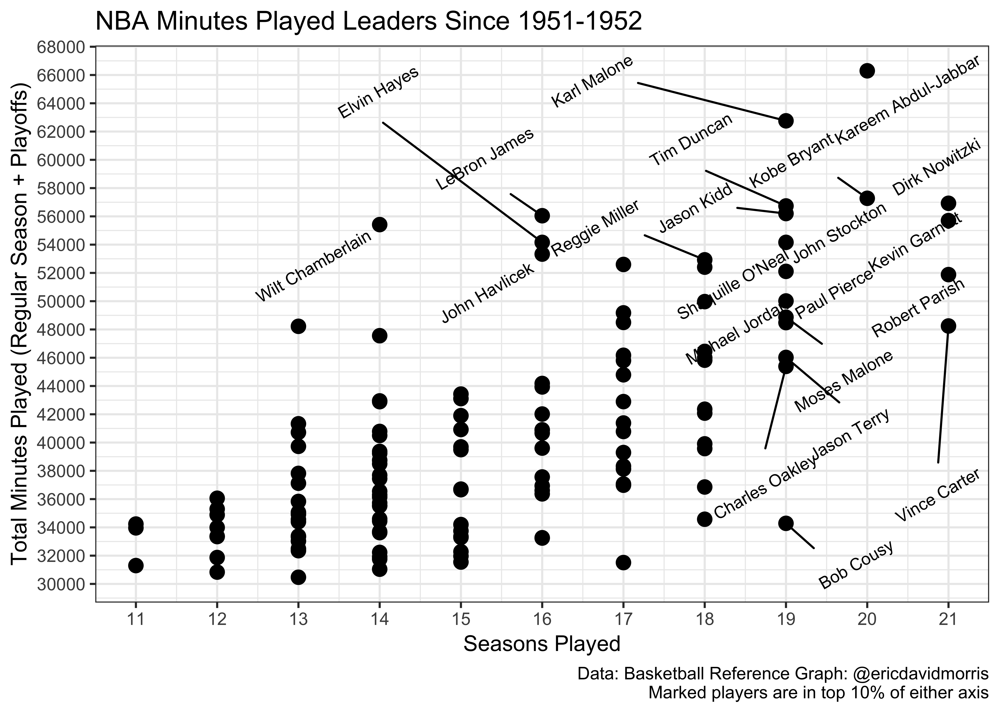

NBA Total MP
================
Eric Morris
3/11/2019

MP Data from Basketball Reference
---------------------------------

All data was pulled from [Basketball Reference](https://www.basketball-reference.com/) on March 11, 2019. Included is total minutes played for the [regular season](https://www.basketball-reference.com/leaders/mp_career.html) and the [playoffs](https://www.basketball-reference.com/leaders/mp_career_p.html) since the 1951-1952 season. Only the top 200 in both regular season and playoff total minutes were pulled.

``` r
reg_total_mp = 
  read_excel("./data/total_reg_mp_3_11_all_stats.xlsx", col_names = TRUE) %>% 
  janitor::clean_names() %>% 
  separate(player, into = c("player", "trash"), sep = "\\\\") %>% 
  mutate(reg_total_mp = mp,
         seasons = (to - from) + 1) %>% 
  select(-rk, -trash)

playoff_total_mp = 
  read_excel("./data/playoff_total_3_11_all_stats.xlsx", col_names = TRUE) %>% 
  janitor::clean_names() %>% 
  separate(player, into = c("player", "trash"), sep = "\\\\") %>% 
  mutate(playoff_total_mp = mp) %>% 
  select(-rk, -trash)

reg_playoff_merge = 
  inner_join(reg_total_mp, playoff_total_mp, by = "player") %>% 
  select(-ends_with(".x"), -ends_with(".y")) %>% 
  mutate(total_mp = (reg_total_mp + playoff_total_mp))
```

First Chart
-----------

``` r
quantile(reg_playoff_merge$total_mp, c(0.5, 0.75, 0.80, 0.85, 0.90, 0.95))
```

    ##      50%      75%      80%      85%      90%      95% 
    ## 38743.00 45239.25 46670.20 49066.55 52630.90 55890.75

``` r
quantile(reg_playoff_merge$seasons, c(0.5, 0.75, 0.80, 0.85, 0.90, 0.95))
```

    ## 50% 75% 80% 85% 90% 95% 
    ##  15  17  18  18  19  19

``` r
reg_playoff_merge %>% 
  ggplot(aes(x = seasons, y = total_mp)) +
  geom_point(alpha = 1, size = 3) +
  geom_text_repel(aes(label = ifelse(seasons >= 19, player, ifelse(total_mp >= 52630, player, ''))), angle = 30, size = 3) +
  labs(title = "NBA Minutes Played Leaders Since 1951-1952", 
       y = "Total Minutes Played (Regular Season + Playoffs)", 
       x = "Seasons Played",
       caption = "Data: Basketball Reference Graph: @ericdavidmorris
       Marked players are in top 10% of either axis") + 
  scale_x_continuous(breaks = seq(10, 22, 1)) + 
  scale_y_continuous(breaks = seq(30000, 68000, 2000)) + 
  theme_bw() +
  theme(legend.position = "bottom")
```



``` r
reg_playoff_merge %>% 
  arrange(desc(total_mp)) %>% 
  top_n(20) %>% 
  rename("Player" = player,
         "Regular Season Total MP" = reg_total_mp,
         "Seasons Played" = seasons,
         "Playoff Total MP" = playoff_total_mp,
         "Total Minutes" = total_mp) %>% 
  knitr::kable(align = "c")
```

    ## Selecting by total_mp

|        Player       | Regular Season Total MP | Seasons Played | Playoff Total MP | Total Minutes |
|:-------------------:|:-----------------------:|:--------------:|:----------------:|:-------------:|
| Kareem Abdul-Jabbar |          57446          |       20       |       8851       |     66297     |
|     Karl Malone     |          54852          |       19       |       7907       |     62759     |
|     Kobe Bryant     |          48637          |       20       |       8641       |     57278     |
|    Dirk Nowitzki    |          51030          |       21       |       5895       |     56925     |
|      Tim Duncan     |          47368          |       19       |       9370       |     56738     |
|      Jason Kidd     |          50111          |       19       |       6088       |     56199     |
|     LeBron James    |          45997          |       16       |       10049      |     56046     |
|    Kevin Garnett    |          50418          |       21       |       5283       |     55701     |
|   Wilt Chamberlain  |          47859          |       14       |       7559       |     55418     |
|    John Stockton    |          47764          |       19       |       6398       |     54162     |
|     Elvin Hayes     |          50000          |       16       |       4160       |     54160     |
|    John Havlicek    |          46471          |       16       |       6860       |     53331     |
|    Reggie Miller    |          47619          |       18       |       5308       |     52927     |
|     Gary Payton     |          47117          |       17       |       5481       |     52598     |
|      Ray Allen      |          46344          |       18       |       6064       |     52408     |
|     Paul Pierce     |          45880          |       19       |       6229       |     52109     |
|    Robert Parish    |          45704          |       21       |       6177       |     51881     |
|   Shaquille O'Neal  |          41918          |       19       |       8098       |     50016     |
|   Hakeem Olajuwon   |          44222          |       18       |       5749       |     49971     |
|    Scottie Pippen   |          41069          |       17       |       8105       |     49174     |
